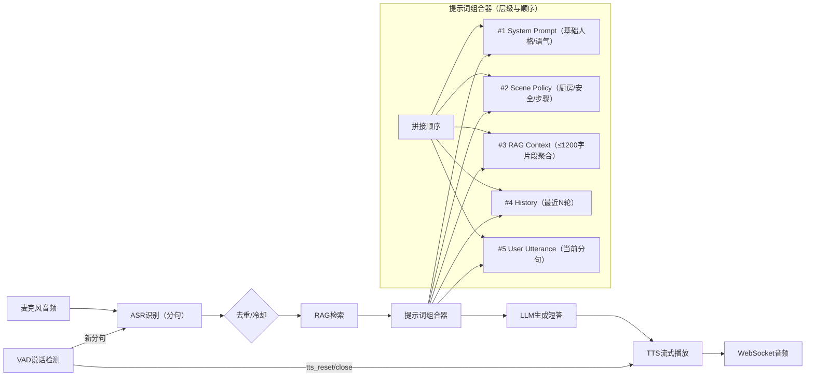

# 项目进度汇报（语音厨助）

## 语音识别模块
- 功能概述：实时把用户语音转为文字，并按短句输出，驱动后续回复与打断。
- 技术方案：WebSocket 长连接推送音频；统一参数 `16kHz/16bit/mono`；返回携带断句标记。
- 输入输出：输入为连续音频切片；输出为包含分句与置信度的识别结果对象。
- 验证结论：本地端到端测试通过；打断场景下能稳定返回最近分句，延迟可控。

### 讲解词
- 这个模块负责把我说的话实时转成文字，并分成一句一句的短句返回给后端。
- 我用的是 WebSocket 长连接，把音频按 16000Hz 的格式小块地推送上去。
- 服务端会解析返回结果里的分句字段，一旦确定一句话结束，就触发后续的回复流程。
- 这样做的好处是延迟低，和打断机制配合时可以比较自然地插话与重启对话。

## 大模型 语义识别及回复模块
- 功能概述：将识别文本交给大模型，结合上下文与知识片段，生成短句式可执行回复。
- 技术方案：系统提示控制风格；保留最近对话上下文；命中 RAG 后拼接知识到提示中。
- 输入输出：输入为当前分句与最近历史；输出为 1–2 句的结构化建议（含比例/时间/步骤）。
- 验证结论：语音链路能稳定生成短答；命中检索时答案具体度显著提升。

### 讲解词
- 这个模块把识别出来的文字交给大模型，生成一段简洁的语音回复文本。
- 我有一段“系统提示”来控制回复风格，更贴近家庭厨房的场景。
- 每次对话会带上最近的历史消息，这样它能理解上下文，不会答非所问。
- 如果 RAG 检索到相关知识，会把知识片段拼到系统提示里，让答案更具体、更可执行。

## TTS 语音生成模块
- 功能概述：将文本实时合成为语音，边合成边播放，支持打断与安全关闭。
- 技术方案：WS 流式合成；可选发音人与采样率；设置打断事件并清理播放队列。
- 输入输出：输入为待合成文本；输出为连续音频流与事件统计（首包、字节数、分段数）。
- 验证结论：合成与播放通路稳定；打断后可重启新的合成会话，体验自然。

### 讲解词
- 这个模块把文本变成语音，采用流式输出，所以我能边说边播放，减少等待。
- 当我开始说话时，会触发打断事件，清空正在播放的队列，防止声音重叠。
- 我支持选择不同的发音人和采样率，方便后续根据场景调音色。
- 模块里还有一个“探针”接口，便于测试首包到达和整体合成是否正常。

## RAG 知识检索模块
- 功能概述：将准备好的知识文档向量化存储，提问时召回相关片段并增强回答。
- 技术方案：离线切片（512–1024字）+ 向量化（bge-small-zh）+ 本地 Chroma 持久库；支持国内镜像与本地模型目录。
- 输入输出：输入为用户问题与可选标签；输出为检索片段（4–6条）与综合后的答案上下文。
- 验证结论：常见菜单与技法问题命中率高，答案能提供具体比例与时间。

### 讲解词
- 这个模块先把我准备的知识文档切片并向量化，存到本地的向量数据库里。
- 当我提问时，先做语义检索，找出最相关的 4–6 个片段拼到提示里，再让大模型回答。
- 好处是答案里能给出很具体的比例、时间和步骤，减少“泛泛而谈”。
- 我也支持国内镜像和本地模型目录，保证在网络不好的时候也能稳定运行。

## 后端功能测试页面
- 功能概述：提供简洁页面与接口，便于在开发阶段快速验证“会话—语音—检索—回复”的闭环。
- 技术方案：静态页 + REST 接口 + WebSocket；本地 `uvicorn` 启动，浏览器即可测试。
- 输入输出：页面操作新建会话、启动语音、查看检索；接口返回 JSON 结果与事件日志。
- 验证结论：本地可稳定访问与交互，日志显示各环节串联顺畅。

### 讲解词
- 我做了一个简单的测试页面，方便我在电脑上直接验证功能。
- 里面可以新建会话、查看会话列表、发起语音连接、以及查看检索结果。
- 这让我在开发阶段不用复杂的前端，也能保证流程是打通的。

## 数据存储模块
- 功能概述：用轻量级 SQLite 保存用户、会话与聊天记录，支持启动时自动建表与索引。
- 技术方案：三张核心表（用户、会话、消息）；开发期限制每用户最多 5 个会话；支持按 `openid` 绑定微信用户。
- 输入输出：输入为注册/登录/新建会话与消息写入；输出为会话列表与历史记录查询结果。
- 验证结论：本地自动创建数据库文件；读写正常；断点恢复后历史仍可用。

### 讲解词
- 我用轻量级的 SQLite 来保存用户、会话和聊天记录，方便本地开发和小型部署。
- 每次启动会检查并创建表结构，开发时期还会重建对话表，保证结构一致。
- 当我创建会话或添加消息时，数据库会同时更新会话的最近时间和标题，便于前端展示。
- 这样做的好处是简单、稳定、无外部依赖，后续上云也可以平滑迁移到托管数据库。

## 阶段结论与下一步
- 结论：语音识别、打断、LLM、TTS 与 RAG 已闭环；本地数据库与模型镜像配置完善。
- 下一步：
  - 增加文本问答接口（非语音场景）：`POST /api/rag_answer` 返回 `answer+sources`。
  - 小程序接入登录与鉴权（`/api/auth/wechat_login` 已提供开发态入口）。
  - 日志与调参：记录检索分数与耗时，优化 `top_k` 与阈值；低分主题补库。

## 提示词架构图（System/User/RAG/History 组合）
- 架构说明：识别分句后，系统提示、RAG片段、历史上下文与当前用户分句在“提示词组合器”中合并，再交给大模型生成短答；随后进入 TTS 播放与打断控制。

```text
[麦克风音频] → [ASR分句] → [去重与冷却] → [RAG检索(top_k, 标签过滤)] → [提示词组合器]
                                                       │                 │
                                                       │                 ├─ System Prompt（风格与规则）
                                                       │                 ├─ RAG Context（命中片段聚合 ≤1200字）
                                                       │                 ├─ History（最近N轮摘要/截断）
                                                       │                 └─ User（当前分句）
                                                       ↓
                                                    [完整提示] → [LLM生成短答] → [TTS流式播放] → [WS音频]

打断控制：VAD检测到说话 → 发送 tts_reset → 关闭当前合成 → 清空队列 → 新分句触发新一轮回复
```



### 提示词融合图（流程+层级）
- 层级说明：按顺序合并 System → Scene → RAG → History → User，形成完整提示，再交给 LLM；已在上图融合展示。

```text
System = 基础人格/语气 + 场景策略 + RAG片段
History = 最近N轮
User = 当前分句
→ 完整提示 = System + User + History → LLM → TTS
```

### 提示词模板示例（实际发送给模型的结构）
```text
SYSTEM = LLM_SYSTEM_PROMPT + "\n" + RAG_TEXT
HISTORY = last_k_turns
USER = current_utterance

MessageArray = [
  {role: system, content: SYSTEM},
  {role: user, content: USER},
  ...HISTORY...
]
```
- 关键代码
```python
from backend.stt.asr_client import ASRClient

asr = ASRClient()
asr.connect()
asr.send_full_request()

def on_obj(o):
    pass

th = asr.start_receiving_objects(on_obj)
```
- 关键代码
```python
from backend.llm.llm_client import LLMClient
from backend.config import LLM_SYSTEM_PROMPT
from backend.rag.retriever import best_text

q = "蚝油芥蓝怎么做"
history = []
sys_prompt = LLM_SYSTEM_PROMPT
rt = best_text(q, 6, 1200)
if rt:
    sys_prompt = sys_prompt + "\n" + rt
llm = LLMClient()
ans = llm.chat(q, system=sys_prompt, history=history)
```
- 关键代码
```python
from backend.tts.tts_client import TTSClient
from backend.config import TTS_VOICE_TYPE

tts = TTSClient(voice_type=TTS_VOICE_TYPE)
tts.connect()
tts.submit_text("做蚝油芥蓝，先焯后收汁")

def on_chunk(b):
    pass

tts.stream_chunks(on_chunk)
tts.close()
```
- 关键代码（离线构建）
```python
import chromadb
from fastembed import TextEmbedding
from backend.config import RAG_DB_PATH, RAG_COLLECTION

client = chromadb.PersistentClient(path=RAG_DB_PATH)
coll = client.get_or_create_collection(name=RAG_COLLECTION, metadata={"hnsw:space": "cosine"})
docs = ["蚝油芥蓝做法", "清蒸鱼时间"]
ids = ["d1", "d2"]
metas = [{"tags": "scene:workday"}, {"tags": "technique:清蒸"}]
m = TextEmbedding(model_name="BAAI/bge-small-zh-v1.5")
embs = list(m.embed(docs))
coll.add(documents=docs, ids=ids, metadatas=metas, embeddings=embs)
```

- 关键代码（在线检索）
```python
import chromadb
from sentence_transformers import SentenceTransformer
from backend.config import RAG_DB_PATH, RAG_COLLECTION

client = chromadb.PersistentClient(path=RAG_DB_PATH)
coll = client.get_or_create_collection(name=RAG_COLLECTION, metadata={"hnsw:space": "cosine"})
m = SentenceTransformer("BAAI/bge-small-zh-v1.5")
q = "蚝油芥蓝怎么做"
qv = m.encode([q], normalize_embeddings=True)[0]
res = coll.query(query_embeddings=[qv], n_results=5, include=["documents", "metadatas", "distances"])
```
- 关键代码
```python
from fastapi import FastAPI
from backend.rag.retriever import search

app = FastAPI()

@app.get("/api/rag_query")
def rag_query(q: str, k: int = 5):
    return search(q, k)
```
